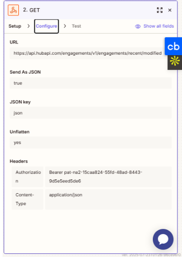
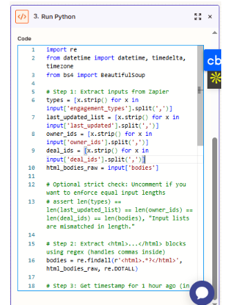
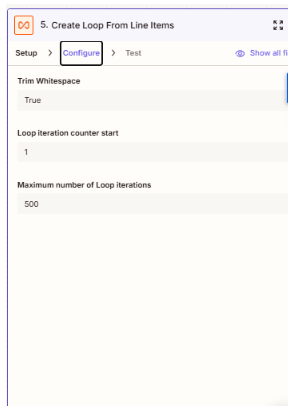
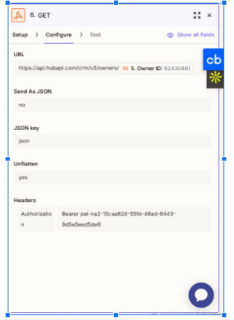
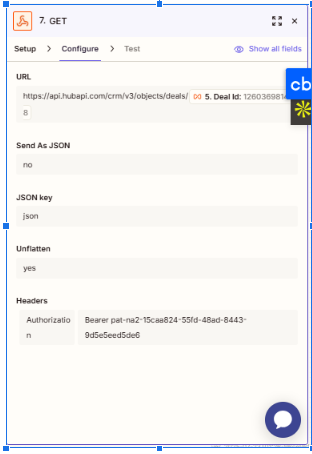
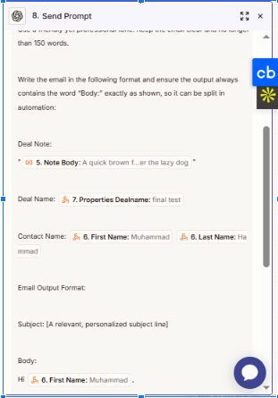
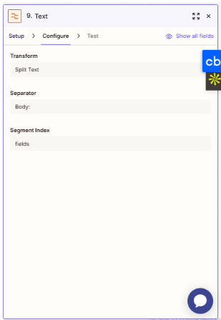
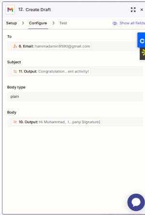

# Email-Drafter v2 (HubSpot Notes → Gmail via GPT-4o-mini)

This project automates personalized Gmail draft creation by detecting updated HubSpot deal notes through scheduled polling and webhook calls. Using GPT-4o-mini, it generates professional outreach emails based on deal updates and saves them as Gmail drafts for manual review or sending.

## 🔧 Project Scope
- Detect updated HubSpot deal notes via scheduled polling.
- Retrieve note, deal, contact, and owner information through webhooks.
- Process and filter updated notes to identify outreach-worthy content.
- Generate concise, professional outreach emails using GPT-4o-mini.
- Save the formatted drafts directly into Gmail for final review.

## 🧩 Tech Stack
- HubSpot CRM (deal notes & engagement data)
- Schedule by Zapier (polling trigger)
- Webhooks by Zapier (HubSpot API calls)
- Code by Zapier (Python for note processing)
- Filter & Looping by Zapier (conditional logic & iteration)
- OpenAI GPT-4o-mini (email drafting)
- Formatter by Zapier (cleanup & structuring)
- Gmail API (draft creation)

## 🔁 Workflow Overview

### 1. ⏰ Scheduled Trigger (Zapier)
- Runs every hour to check for updated HubSpot deal notes.

### 2. 🌐 GET Notes via Webhook
- Calls HubSpot API to fetch notes or engagements updated within the last hour.

### 3. 🐍 Run Python Code (Zapier)
- Processes response data.
- Identifies which notes are new, updated, or relevant.

### 4. ⚖️ Filter Conditions
- Ensures only valid, outreach-worthy notes (e.g., non-empty, relevant content) proceed.

### 5. 🔁 Loop Through Notes
- Iterates through each qualifying note to avoid batching issues.

### 6–7. 📊 GET Additional Data (Webhooks)
- Retrieves deal details, owner information, and contact data for personalization.

### 8. 🧠 AI Content Generation (GPT-4o-mini)
- Uses custom prompt with note + deal + owner data.
- Generates a smart, professional follow-up email.

### 9–11. 🛠 Text Formatting (Zapier Formatter)
- Cleans unwanted characters and formats output into subject/body/signature.

### 12. ✉️ Create Gmail Draft
- Saves the AI-generated content into Gmail drafts for review or sending.

## 📈 Outcomes & Use Cases
- Automates timely follow-up workflows triggered by HubSpot note updates.
- Provides relevant, personalized outreach emails tied to fresh deal activity.
- Ensures consistent professional tone across communications.
- Reduces manual drafting time and scales easily across sales teams.
